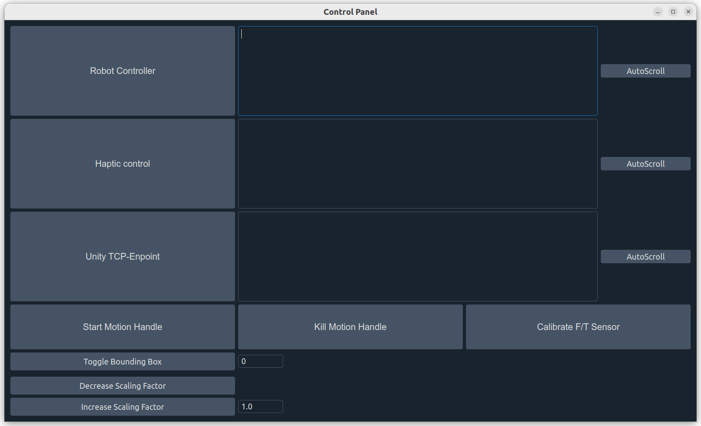

## Ultrasound_PyQtGui
This is a Qt Gui for simplyfing the launch of the different modules required for the ultrasound examination teleoperation.

### Current features:
The current GUI includes:  
    - Launch buttons  
    - Output for each process relative to each button  
    - stream of the ultrasound probe  

